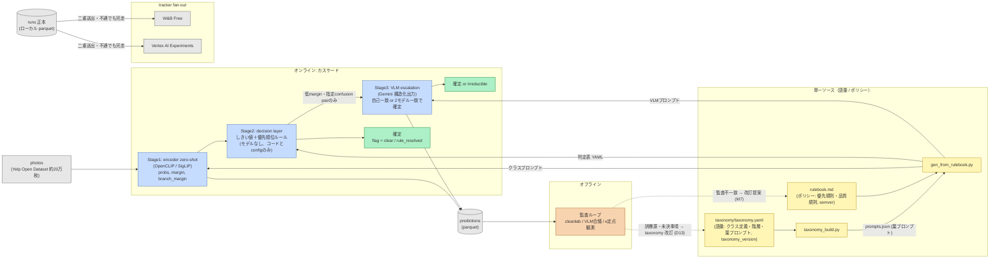

# A. システムアーキテクチャ

正本: [docs/design.md](../design.md) §1, §3, §4

```mermaid
flowchart LR
    classDef stage fill:#c6dcff,stroke:#305bab
    classDef store fill:#e7e7e7,stroke:#595959
    classDef final fill:#adf0c7,stroke:#087429
    classDef offline fill:#f8d3af,stroke:#9b4a07
    classDef source fill:#fff6b6,stroke:#af7e02

    photos["photos<br/>(Yelp Open Dataset 約20万枚)"]:::store

    subgraph online["オンライン: カスケード"]
        S1["Stage1: encoder zero-shot<br/>(OpenCLIP / SigLIP)<br/>probs, margin, branch_margin"]:::stage
        S2["Stage2: decision layer<br/>しきい値＋優先順位ルール<br/>(モデルなし、コードとconfigのみ)"]:::stage
        S3["Stage3: VLM escalation<br/>(Gemini 構造化出力)<br/>自己一致 or 2モデル一致で確定"]:::stage
        FIX1["確定<br/>flag = clear / rule_resolved"]:::final
        FIX2["確定 or irreducible"]:::final
    end

    PRED[("predictions<br/>(parquet)")]:::store
    RUNS[("runs 正本<br/>(ローカル parquet)")]:::store

    subgraph offline_g["オフライン"]
        AUDIT["監査ループ<br/>cleanlab / VLM合議 / κ定点観測"]:::offline
    end

    subgraph single_source["単一ソース（語彙 / ポリシー）"]
        TX["taxonomy/taxonomy.yaml<br/>(語彙: クラス定義・階層・葉プロンプト, taxonomy_version)"]:::source
        TB["taxonomy_build.py"]:::source
        RB["rulebook.md<br/>(ポリシー: 優先規則・品質規則, semver)"]:::source
        GEN["gen_from_rulebook.py"]:::source
    end

    subgraph tracking["tracker fan-out"]
        WB["W&B Free"]:::store
        VX["Vertex AI Experiments"]:::store
    end

    photos --> S1
    S1 --> S2
    S2 --> FIX1
    S2 -->|"低margin・指定confusion pairのみ"| S3
    S3 --> FIX2
    S1 --> PRED
    S3 --> PRED
    PRED --> AUDIT
    AUDIT -.->|"監査不一致 → 改訂提案 (M7)"| RB
    AUDIT -.->|"誤爆源・未決事項 → taxonomy 改訂 (D13)"| TX
    TX --> TB
    TB -->|"prompts.json (葉プロンプト)"| GEN
    RB --> GEN
    GEN -->|"クラスプロンプト"| S1
    GEN -->|"判定表 YAML"| S2
    GEN -->|"VLMプロンプト"| S3
    RUNS -->|"二重送出・不通でも完走"| WB
    RUNS -->|"二重送出・不通でも完走"| VX
```
