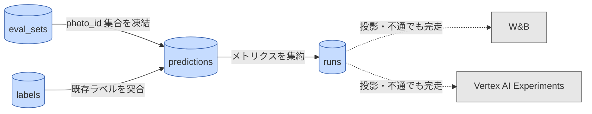

# 実験記録の正本はローカル parquet であり、外部トラッカーはその投影にすぎない

対象読者: 実装者。永続データと記録先のみを描く（実行時フローは [runtime-decision-path.md](runtime-decision-path.md)）。

**青 = 正本（ローカル parquet、DuckDB） ／ 灰 = 外部トラッカー ／ 点線 = 失敗してよい経路**

トラッカーを実験ごとに排他切替すると履歴が分断され横断比較が壊れるため、**切替ではなく二重送出（fan-out）**とする。`tracking: [wandb, vertex]` の任意の組合せ（空も可）を config で指定し、どのバックエンドが不通でも run 本体は完走する。この縮退動作（wandb のみ / vertex のみ / none）は M0 でテストする。

各テーブルの列は design.md §5 に定義。型は BigQuery 互換のみを使い、実データ側では接続先の差し替えだけで同一の分析 SQL が走る（DuckDB / BigQuery 両対応）。

制約: トラッカーへ画像・生データはアップロードしない（scalar / 小テーブル / reference artifact のみ）。`eval_sets` は photo_id リストのハッシュで凍結し、W&B reference artifact で版管理する。Vertex AI TensorBoard は課金対象のため有効化しない。

正本: [design.md](../design.md) §3, §5
