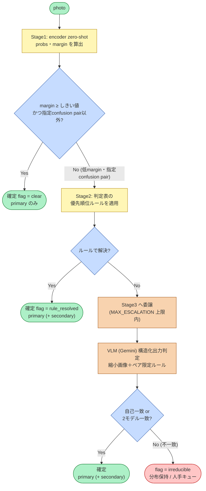

# B. 1枚の写真の判定フロー

正本: [docs/design.md](../design.md) §1, §4

```mermaid
flowchart TD
    classDef general fill:#fff6b6,stroke:#af7e02
    classDef decision fill:#c6dcff,stroke:#305bab
    classDef terminator fill:#adf0c7,stroke:#087429
    classDef escalate fill:#f8d3af,stroke:#9b4a07
    classDef irred fill:#ffc6c6,stroke:#bd0909

    P(["photo"]):::terminator
    S1["Stage1: encoder zero-shot<br/>probs・margin を算出"]:::general
    Q1{"margin ≥ しきい値<br/>かつ指定confusion pair以外?"}:::decision
    C1(["確定 flag = clear<br/>primary のみ"]):::terminator
    R["Stage2: 判定表の<br/>優先順位ルールを適用"]:::general
    Q2{"ルールで解決?"}:::decision
    C2(["確定 flag = rule_resolved<br/>primary (+ secondary)"]):::terminator
    E["Stage3 へ委譲<br/>(MAX_ESCALATION 上限内)"]:::escalate
    V["VLM (Gemini) 構造化出力判定<br/>縮小画像＋ペア限定ルール"]:::escalate
    Q3{"自己一致 or<br/>2モデル一致?"}:::decision
    C3(["確定<br/>primary (+ secondary)"]):::terminator
    I(["flag = irreducible<br/>分布保持 / 人手キュー"]):::irred

    P --> S1
    S1 --> Q1
    Q1 -->|"Yes"| C1
    Q1 -->|"No (低margin・指定confusion pair)"| R
    R --> Q2
    Q2 -->|"Yes"| C2
    Q2 -->|"No"| E
    E --> V
    V --> Q3
    Q3 -->|"Yes"| C3
    Q3 -->|"No (不一致)"| I
```
