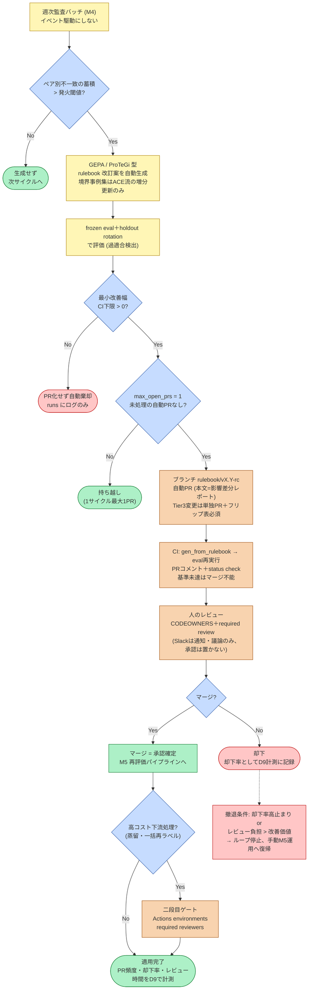

# E. M7 self-improving rulebook loop — PR承認ゲート

正本: [docs/design.md](../design.md) §6 M7

```mermaid
flowchart TD
    classDef general fill:#fff6b6,stroke:#af7e02
    classDef decision fill:#c6dcff,stroke:#305bab
    classDef terminator fill:#adf0c7,stroke:#087429
    classDef reject fill:#ffc6c6,stroke:#bd0909
    classDef gate fill:#f8d3af,stroke:#9b4a07

    W["週次監査バッチ (M4)<br/>イベント駆動にしない"]:::general
    T{"ペア別不一致の蓄積<br/>> 発火閾値?"}:::decision
    NOGEN(["生成せず<br/>次サイクルへ"]):::terminator
    G["GEPA / ProTeGi 型<br/>rulebook 改訂案を自動生成<br/>境界事例集はACE流の増分更新のみ"]:::general
    H["frozen eval＋holdout rotation<br/>で評価 (過適合検出)"]:::general
    Q1{"最小改善幅<br/>CI下限 > 0?"}:::decision
    REJ(["PR化せず自動棄却<br/>runs にログのみ"]):::reject
    Q2{"max_open_prs = 1<br/>未処理の自動PRなし?"}:::decision
    HOLD(["持ち越し<br/>(1サイクル最大1PR)"]):::terminator
    PR["ブランチ rulebook/vX.Y-rc<br/>自動PR (本文=影響差分レポート)<br/>Tier3変更は単独PR＋フリップ表必須"]:::gate
    CI["CI: gen_from_rulebook → eval再実行<br/>PRコメント＋status check<br/>基準未達はマージ不能"]:::gate
    REV["人のレビュー<br/>CODEOWNERS＋required review<br/>(Slackは通知・議論のみ、承認は置かない)"]:::gate
    QM{"マージ?"}:::decision
    CLOSE(["却下<br/>却下率としてD9計測に記録"]):::reject
    OK["マージ = 承認確定<br/>M5 再評価パイプラインへ"]:::terminator
    Q3{"高コスト下流処理?<br/>(蒸留・一括再ラベル)"}:::decision
    G2["二段目ゲート<br/>Actions environments<br/>required reviewers"]:::gate
    DONE(["適用完了<br/>PR頻度・却下率・レビュー時間をD9で計測"]):::terminator
    EXIT["撤退条件: 却下率高止まり or<br/>レビュー負担 > 改善価値<br/>→ ループ停止、手動M5運用へ復帰"]:::reject

    W --> T
    T -->|"No"| NOGEN
    T -->|"Yes"| G
    G --> H
    H --> Q1
    Q1 -->|"No"| REJ
    Q1 -->|"Yes"| Q2
    Q2 -->|"No"| HOLD
    Q2 -->|"Yes"| PR
    PR --> CI
    CI --> REV
    REV --> QM
    QM -->|"No"| CLOSE
    QM -->|"Yes"| OK
    OK --> Q3
    Q3 -->|"No"| DONE
    Q3 -->|"Yes"| G2
    G2 --> DONE
    CLOSE -.-> EXIT
```
