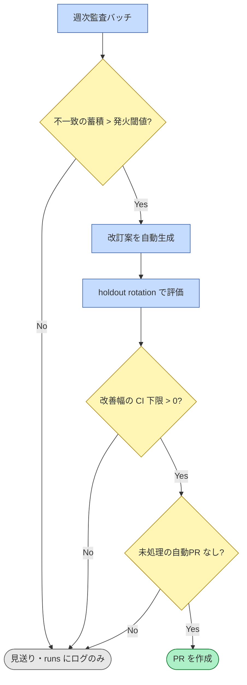
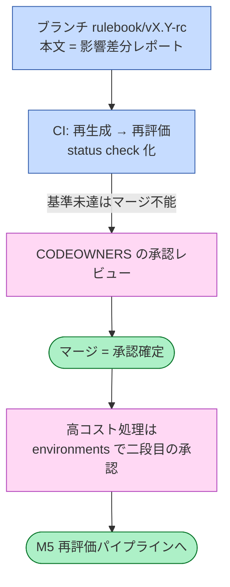

# M7 自動改訂ループのゲート設計

対象読者: 実装者。M7 は design.md 上「（任意）」であり、M0–M5 完了後に着手する。

## 1. 自動改訂案は、3つのゲートを通らなければ PR にすらならない

**黄 = ゲート ／ 灰 = ここで止まる ／ 緑 = 通過**

3つのゲートはいずれも「PR を作らせない」ために置く。①**発火制御**: 生成は週次バッチに従属させ、イベント駆動にしない。②**改善ゲート**: holdout rotation（評価分割を回転させ過適合を検出）で最小改善幅を満たさない候補は PR 化せず自動棄却する。③**レート上限**: 1サイクル最大1PR、かつ `max_open_prs=1`。

頻度は成り行きではなく発火閾値で制御するガバナンス変数とし、PR発生頻度・却下率・レビュー所要時間を D9 の計測項目に含める。

## 2. 承認プリミティブは PR のマージであり、diff の見える場所にしか承認を置かない

**桃 = 人の承認 ／ 青 = 自動処理 ／ 緑 = 到達点**

`rulebook.md` に CODEOWNERS と required approving review を設定し、**マージそのものを承認確定とする**。蒸留・一括再ラベルなど高コストな下流処理には Actions environments の required reviewers で二段目のゲートを設ける。

Slack は通知・催促・議論に限定し、**承認行為は置かない**。diff の見えない場所での承認は、監査痕跡を分散させるため。

**変更の3層ポリシー**: Tier 1＝境界事例集への追記（最頻・最軽、週次PRに同梱）／ Tier 2＝ルールの新規追加（minor bump、同梱可）／ Tier 3＝既存ルールの修正・優先順位変更（既存判定のフリップ発生源。単独PR＋フリップ表必須、フリップ率が基準超なら目視サンプルレビュー。D8 と接続）。

**撤退条件**（フローではなく運用ポリシー）: 却下率が高止まりする、またはレビュー負担が改善価値を上回ると計測された場合はループを停止し、手動 M5 運用（人が起点、機械は影響分析のみ）へ戻す。この条件を D9 の採否基準に含める。

正本: [design.md](../design.md) §6 M7, §8 D9
