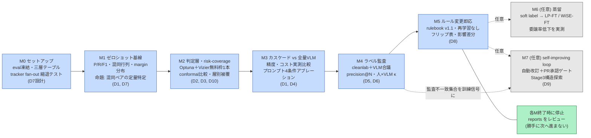

# C. マイルストーンロードマップ

正本: [docs/design.md](../design.md) §6, §8

```mermaid
flowchart LR
    classDef core fill:#c6dcff,stroke:#305bab
    classDef optional fill:#e7e7e7,stroke:#595959
    classDef gate fill:#adf0c7,stroke:#087429

    M0["M0 セットアップ<br/>eval凍結・三層テーブル<br/>tracker fan-out 縮退テスト<br/>(D7設計)"]:::core
    M1["M1 ゼロショット基線<br/>P/R/F1・混同行列・margin分布<br/>命題: 混同ペアの定量特定<br/>(D1, D7)"]:::core
    M2["M2 判定層・risk-coverage<br/>Optuna＋Vizier無料枠1本<br/>conformal比較・層別被覆<br/>(D2, D3, D10)"]:::core
    M3["M3 カスケード vs 全量VLM<br/>精度・コスト実測比較<br/>プロンプト4条件アブレーション<br/>(D1, D4)"]:::core
    M4["M4 ラベル監査<br/>cleanlab＋VLM合議<br/>precision@N・人×VLM κ<br/>(D5, D6)"]:::core
    M5["M5 ルール変更即応<br/>rulebook v1.1・再学習なし<br/>フリップ表・影響差分<br/>(D8)"]:::core
    M6["M6 (任意) 蒸留<br/>soft label → LP-FT / WiSE-FT<br/>委譲率低下を実測"]:::optional
    M7["M7 (任意) self-improving loop<br/>自動改訂＋PR承認ゲート<br/>Stage3構造探索<br/>(D9)"]:::optional
    STOP["各M終了時に停止<br/>reports をレビュー<br/>(勝手に次へ進まない)"]:::gate

    M0 --> M1 --> M2 --> M3 --> M4 --> M5
    M5 -.->|"任意"| M6
    M5 -.->|"任意"| M7
    M4 -.->|"監査不一致集合を訓練信号に"| M7
    M5 --- STOP
```
