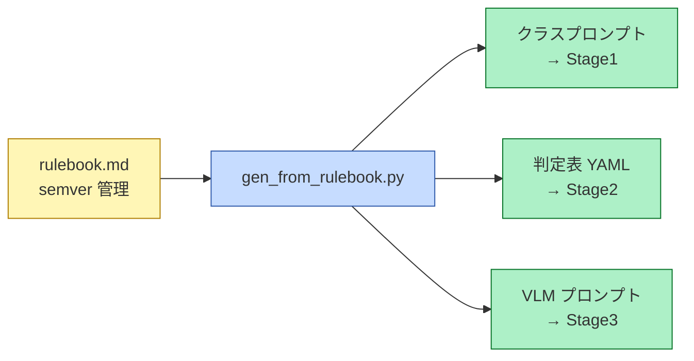

# Stage1/2/3 の全分類ロジックは rulebook.md から生成され、手書きの重複定義は存在しない

対象読者: 実装者。ビルド時（生成時）のみを描く。実行時にこの矢印は流れない。

**黄 = 単一ソース ／ 青 = 生成スクリプト ／ 緑 = 生成物**

`rulebook.md` の構成は (a) 分類意図＝閲覧者がどのタブにその写真を期待するか (b) クラス定義 (c) 曖昧ペアごとの優先順位ルール (d) 境界事例の文例。この4節から3つの生成物がすべて導出される。

**手書きの重複定義を禁止する**のが単一ソース原則の核心。クラス定義がプロンプトと判定表に二重に書かれていると、片方だけ更新されて静かに矛盾する。生成物は編集せず、必ず rulebook を直して再生成する。

版管理は semver（`rulebook_version`）で、runs と reports に必ず刻印する。どの判定がどの版のルールで下されたかを後から追跡できるようにするため。`gen_from_rulebook.py` はユニットテスト必須（Stage2 判定層と並んで、テストが要求される2箇所のうちの1つ）。

ルール変更の運用上の意味は [value-rule-agility.md](value-rule-agility.md)、自動改訂の統制は [m7-gates.md](m7-gates.md)。

正本: [design.md](../design.md) §4
