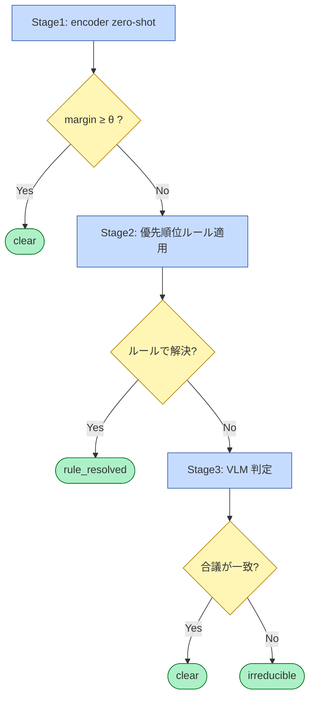

# 1枚の写真は最大3段を通り、必ず三値フラグのいずれかで終端する

対象読者: 実装者。実行時（推論時）のみを描く。

**青 = 処理 ／ 黄 = 分岐 ／ 緑 = 終端（三値フラグ）**

各段の詳細:

- **Stage1** — OpenCLIP / SigLIP のゼロショット分類。クラスプロンプトは rulebook から生成。出力は `probs` と `margin`（上位2クラスの確率差）
- **分岐条件 θ** — margin のしきい値。粒度（大域 / クラス別 / ペア別）は D2 で決定する。加えて「指定 confusion pair に該当するか」も委譲条件に含む。conformal prediction による予測集合ベースの委譲（集合サイズ=1で確定、≥2で委譲）との比較は D10
- **Stage2** — モデルを使わない決定的な判定層。rulebook から生成した判定表（YAML）に従う。コードと config のみ
- **Stage3** — Gemini の構造化出力。委譲スライスのみを対象とし、呼び出しは `MAX_ESCALATION`（既定 5,000）の上限内。構成（単発 / 自己一致 / 2モデル一致、Stage1 確率を渡すか）は D4 のアブレーションで決定する
- **出力** — `primary`、`secondary`（任意）、`flag ∈ {clear, rule_resolved, irreducible}`。Stage1 と Stage3 の結果は `predictions` テーブルに記録される

正本: [design.md](../design.md) §1, §4, §7
