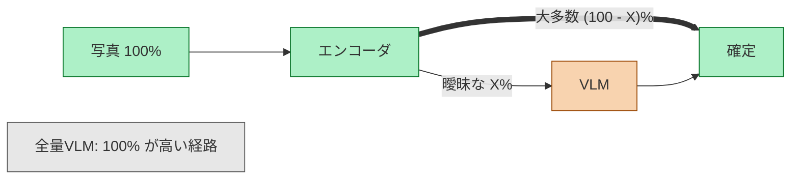

# 確信できる大多数は安く確定し、曖昧な少数だけに VLM の金を払う

**コスト: 全量VLM比 Y% ／ 精度: 同等圏（macro-F1 差 ≤ Z）**

太い矢印が安い経路、細い矢印が高い経路。この非対称性がカスケードの存在理由で、灰色の「全量VLM」は比較対象（すべてが高い経路を通る世界）。X / Y / Z は M3 で実測して確定する（判断基準は [design.md](../design.md) §8 D1: 委譲率≤X% で目標精度、かつ全量VLM比コスト<Y%）。現時点で数値は入っていない — 本リポジトリは実測値のみを掲載する方針のため。

エンコーダは OpenCLIP / SigLIP のゼロショット分類、VLM は Gemini の構造化出力判定。委譲の判定規則は [runtime-decision-path.md](runtime-decision-path.md)。

正本: [design.md](../design.md) §1, §6 M3
