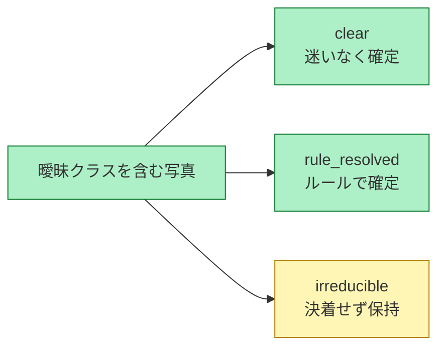

# 決められないものを、無理に決めない

**緑 = 自動で確定 ／ 黄 = 人手キューへ回し、分布を保持**

多くの分類システムは必ず1クラスを吐く。本設計は「決着しない」を三値フラグの一級市民として持ち、誤って断定する代わりに保持する。運用上、誤ラベルが下流に流れるコストは、保留のコストより高いことが多いため。

この設計の妥当性は主観ではなく測定で裏付ける。不一致帯において人間同士の一致度（κ）が低いことを示せれば、「機械が決められない」のではなく「そもそも人間にも決まらない」ことの証拠になる（[design.md](../design.md) §8 D5、M4 で実測）。各フラグの割合も M2–M3 で確定する。

フラグがどう決まるかは [runtime-decision-path.md](runtime-decision-path.md)。

正本: [design.md](../design.md) §4, §8 D5
