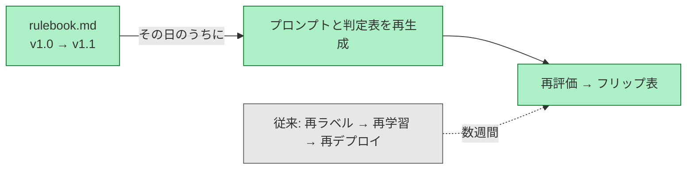

# 分類ルールが変わっても、モデルを再学習しない

**緑 = 本設計（Markdown 1ファイルの改版で完結） ／ 灰 = 従来の経路**

分類の意図・優先順位ルールは `rulebook.md` に単一ソースとして置かれ、Stage1 のクラスプロンプト・Stage2 の判定表・Stage3 の VLM プロンプトはすべてそこから生成される。したがってルール変更で触るのは Markdown 1ファイルだけで、モデルの重みは一切変わらない。

変更の影響は自動で可視化する。再評価で「どの写真の判定がどう変わったか」のフリップ表が出るため、変更を承認する側は影響範囲を見てから判断できる（フリップ率が基準を超えたら人手レビュー必須 — [design.md](../design.md) §8 D8）。所要時間の対比は M5 で実測する。

生成の詳細は [rulebook-codegen.md](rulebook-codegen.md)。

正本: [design.md](../design.md) §4, §6 M5
