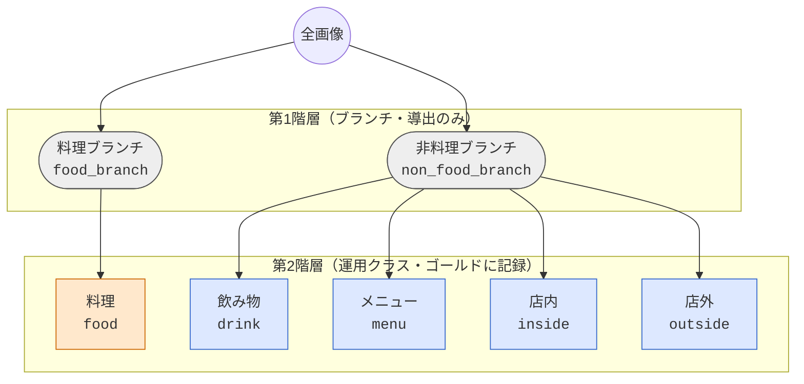

# taxonomy tree — yelp-restaurant-photos v0.1.0

生成物（`taxonomy_viz.py`）。手編集禁止。正本は `taxonomy.yaml`。

## 概念一覧

| level | node_id | prefLabel | broader | derived_level1 | definition |
|---|---|---|---|---|---|
| 1 | `food_branch` | 料理ブランチ | — | `food_branch` | 主被写体が料理である画像のブランチ。二値フラグ（food / not-food）の吸収先であり、ゴールドには記録せず第2階層の親として導出する。 |
| 1 | `non_food_branch` | 非料理ブランチ | — | `non_food_branch` | 主被写体が料理ではない画像のブランチ。「料理でない」という否定を、配下の肯定クラス（drink / menu / inside / outside）の列挙で表現する。 |
| 2 | `food` | 料理 | food_branch | `food_branch` | 皿・丼・器に盛られた料理、または食材そのものが主被写体である画像。デザート・パン・スナックを含む。 |
| 2 | `drink` | 飲み物 | non_food_branch | `non_food_branch` | グラス・カップ・ボトルに入った飲料が主被写体である画像。アルコール飲料・コーヒー・ジュース・スムージーを含む。 |
| 2 | `menu` | メニュー | non_food_branch | `non_food_branch` | 印刷されたメニュー、黒板・掲示のメニューボード、価格表など、提供品目を列挙した文書が主被写体である画像。 |
| 2 | `inside` | 店内 | non_food_branch | `non_food_branch` | 店舗の内部空間（客席・カウンター・厨房・内装）を主被写体とする画像。店内で撮られていても、料理・飲み物・メニューが主被写体ならそれぞれのクラスに属する。 |
| 2 | `outside` | 店外 | non_food_branch | `non_food_branch` | 店舗の外観（ファサード・看板・入口・テラス席・周辺の街路）を主被写体とする画像。 |

## Stage1 プロンプト（class_order: food, drink, menu, inside, outside）

| class | source | prompt (en) |
|---|---|---|
| `food` | `food` | a photo of food served at a restaurant |
| `food` | `food` | a photo of a dish on a table |
| `food` | `food` | a photo of a plate of food |
| `food` | `food` | a close-up photo of a meal |
| `drink` | `drink` | a photo of a drink served at a restaurant |
| `drink` | `drink` | a photo of beverages on a table |
| `drink` | `drink` | a photo of a cocktail in a glass |
| `drink` | `drink` | a photo of a cup of coffee |
| `menu` | `menu` | a photo of a restaurant menu |
| `menu` | `menu` | a photo of a printed menu |
| `menu` | `menu` | a photo of a menu board on the wall |
| `inside` | `inside` | a photo of the interior of a restaurant |
| `inside` | `inside` | a photo of a restaurant dining room |
| `inside` | `inside` | a photo of tables and chairs inside a restaurant |
| `inside` | `inside` | a photo of a bar counter inside a restaurant |
| `outside` | `outside` | a photo of a restaurant storefront |
| `outside` | `outside` | a photo of the exterior of a restaurant building |
| `outside` | `outside` | a photo of a restaurant sign seen from the street |
| `outside` | `outside` | a photo of an outdoor patio of a restaurant |

## changeNote

- 0.1.0 (2026-09-07): 初版。第1階層 2 ブランチ・第2階層 5 運用クラス。第3階層なし。プロンプトは素朴なフラット版（M1 で調整）
